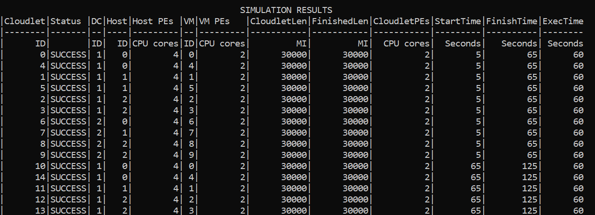

# cloudsim-cs441-hw3

Author: Venkatesh Gopalakrishnan

**About the project** 

The project explores setting up a cloud organisation using Cloudsim Plus. I've created 3 datacenters in each simulation. The datacenters are connected in a bus topology. 
Each have N hosts with different configurations and pricing policies as defined in the resources/.conf files.
A broker receives the cloudlets to be processed and assigns them to the appropriate VM that will be run on one
of the hosts (physical machines) in the datacenters. I explore how different VM allocation policy 
(Simple vs FirstFit vs BestFit vs RoundRobin) to the hosts and cloudlet scheduling policies (Time shared vs 
Space shared) on the VMs lead to different results. I also explore how having datacenters that offer varying levels 
of SAAS, FAAS, PAAS & IAAS offerings results in different outcomes

****

**Running the project** 
To run the project, follow the below steps:
<ul>
<li>Download or connect to this git repo through IntelliJ</li>
<li>In IntelliJ, the main driver function is in MainDriver.scala. Running that will trigger all simulations</li>
<li>Alt, you can run _**sbt clean run**_ from terminal from the root folder of the project</li>
<li>
Guide for using configuration files:
<ul>
<li>All .conf files are under resources</li>
<li>
application.conf has the configs defined to run sims for VM alloc policy and Cloudlet sch policy. 
You can edit the utilization ratio, Host configs, VM configs & cloudlet configs
</li>
<li>
dcServicesSimulation.conf defines the configs for simulating a cloud org that offers 3 datacenters with 
varying mix of SAAS, PAAS, IAAS & FAAS. For each DC, you can edit the utilization ratio, Host configs, 
VM configs & cloudlet configs. 
</li>
<li>
The dcPaasSim.conf is assumed to be a client config for their cloudlets as part of their PAAS agreement
</li>
<li>
The dcIaasSim.conf is assumed to be a client config for their VMs & cloudlets as part of their IAAS agreement
</li>
</ul>
</li>
</ul>

****

**Simulation Results & Analysis** 
**VM Allocation Policies**

